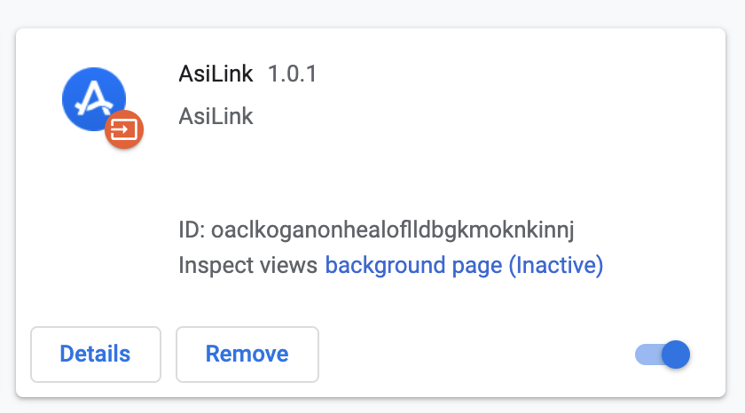
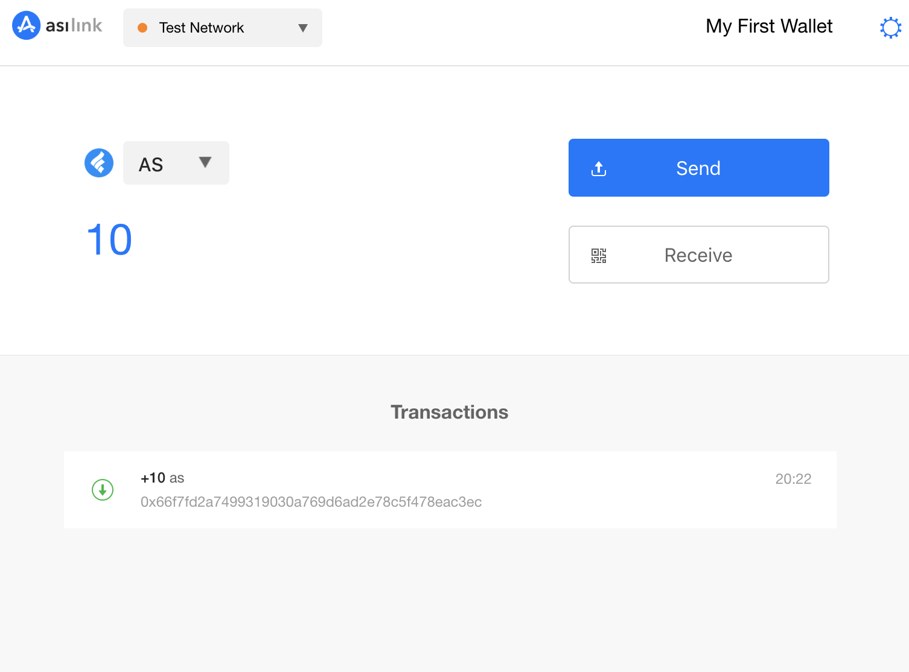
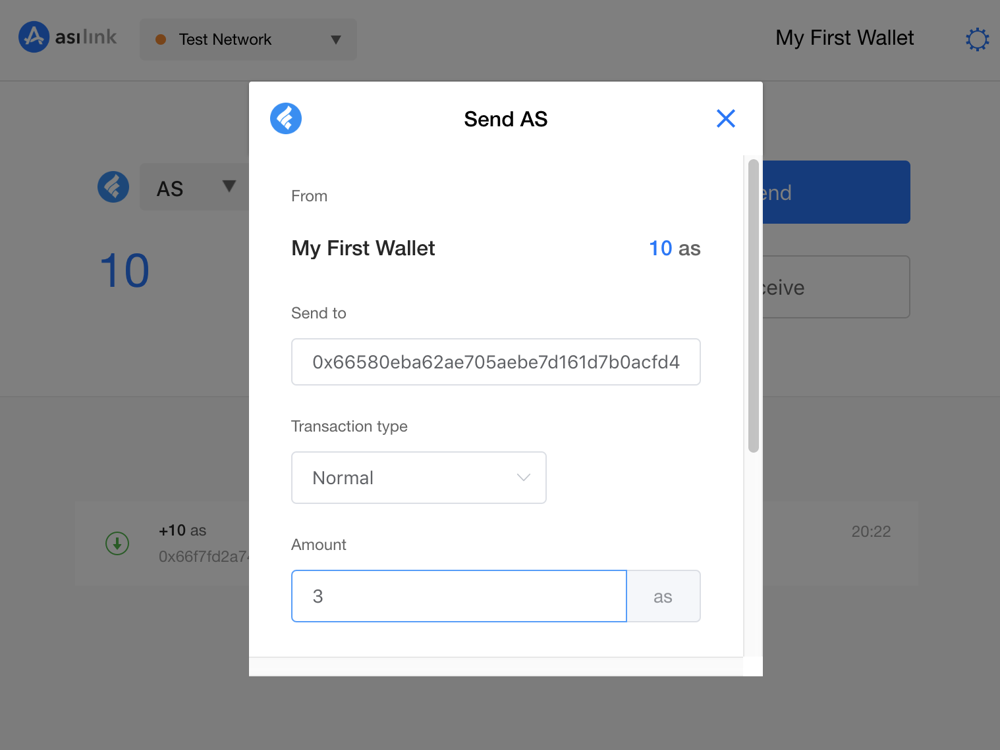
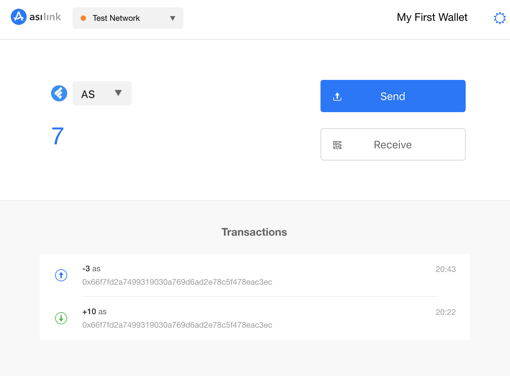
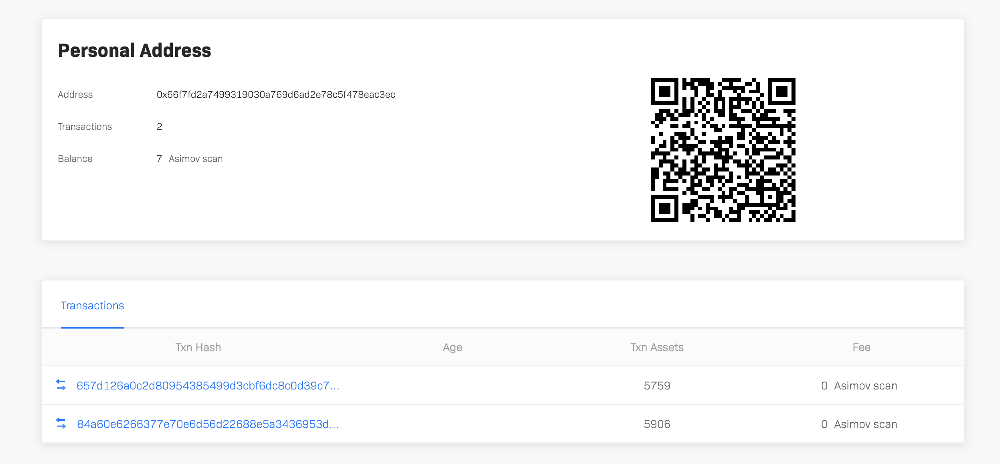

## Document Overview

This document briefly describes the use of the AsiLink wallet. AsiLink is the official Chrome-based plug-in wallet provided by Asimov, which is designed for basic scenarios such as autonomous organization, validator and developer center in Asimov.

## Download and Install

[Download](https://asimov.network/wallet) AsiLink plugin wallet from the Asimov official website, open the Chrome browser extensions (chrome://extensions/) page, drag in the newly downloaded wallet crx file for installation. Verify that the plugin wallet is installed successfully, as shown below:



## Setup Wallet

Open AsiLink and click the ```Create Wallet``` button.


Input user password.


Save the mnemonic words.


Verify the mnemonic words.


Click the ```Confirm``` button to create the wallet.

## Obtain ASC on TestNet

After the wallet is created successfully, switch to the Test Network. Initially there are no assets. Go to [faucet](https://ide.asimov.work/#/receive) page on TestNet to get some test ASC. Input the wallet address created above and receive 10 test ASC.


Open AsiLink to confirm the test ASC is received.



## Transfer

Click the ```Send``` button on AsiLink to open the transfer page. Input the target address and amount, click ```Confirm and Send```, then input the user password to create the transaction.



Close AsiLink, wait for the block to to confirmed, and reopen it after 5 seconds to verify the transaction was successful.



You can also open the AScan page and search for wallet address to confirm the transfer action.

