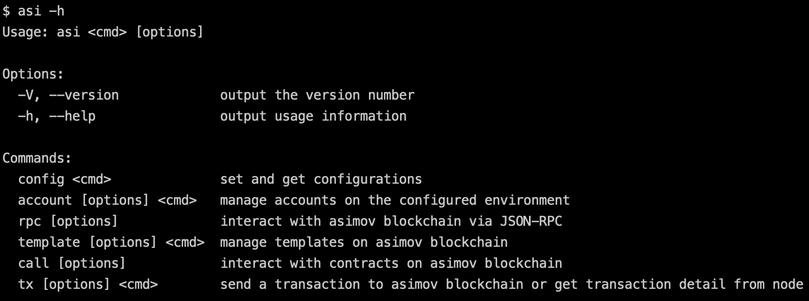
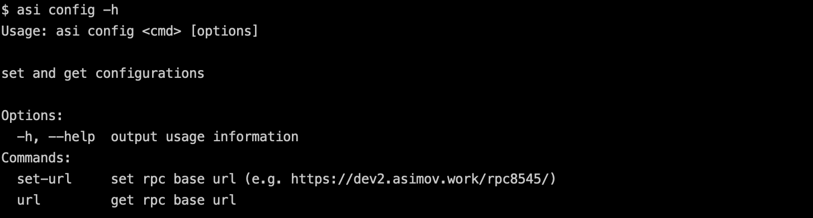
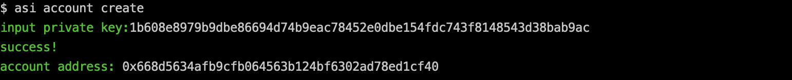
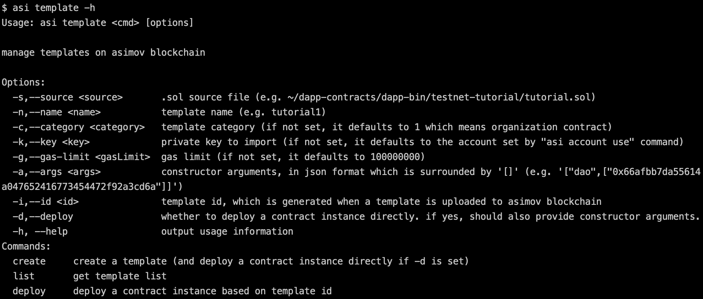
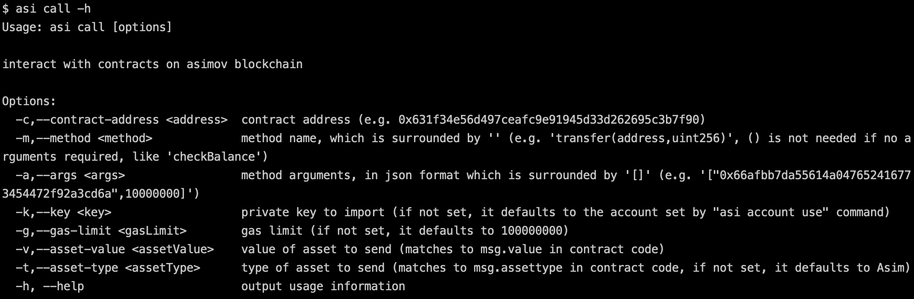

## Overview

This document shows how to use the Asimov blockchain cmd tool.

## Installation

```npm install -g @asimovdev/asimov-cli```

After successfully install asimov cmd tool, try ```asi -h```



## Config

You can set configuration parameters for the cmd tool. Currently, there is only one parameter which is the url to provide rpc services. ```asi config -h```



if not set, it defaults to ```http://127.0.0.1:8545```. 

> Note that the asimov cmd tool needs to run against a local/remote asimov node.

## Account

You need to setup accounts for the cmd tool before interacting with asimov blockchain. ```asi account -h```


Try ```asi account create``` and import a private key to create an account



Try ```asi account use``` to set a default account


Try ```asi account list```, ```asi account balance``` and ```asi account utxo``` to view list of accounts, balances and utxo sets.

## RPC

You can construct an RPC call to interact with asimov node by using the rpc cmd. ```asi rpc -h```


> RPC documentation link: [Asimov RPC](./rpc.md)


Note you can do everything against the Asimov blockchain through the rpc cmd. The below **template**, **call**, **tx** cmd are shortcuts for corresponding rpc calls.

## Template

You can use the template cmd to submit template and deploy contract instance. ```asi template -h```



Try ```asi template -s /Users/xxd/gitflow/dapp-contracts/dapp-bin/testnet-tutorial.sol -n tutorial-1 create``` to submit a template.


Then try ```asi template -i 788f535791e06a816d30ef953366feb7544adec84f4e032ab663fd45b38a1b69 -a '["t1"]'  deploy``` to deploy a contract instance based on the template submitted in the previous step.


Or, you can combine create/deploy together by ```asi template -s /Users/xxd/gitflow/dapp-contracts/dapp-bin/testnet-tutorial/tutorial.sol -n tutorial-2 -d -a '["t2"]' create```


## Call

You can interact with a contract deployed on asimov by the call cmd. ```asi call -h```



Try ```asi call -c 0x6398444ae8c81285b1fe0571c1d1e1d6908d22729c -m 'mint(uint256)' -a '[10000000000]'``` to call a public function in a contract.


Try ```asi call -c 0x6398444ae8c81285b1fe0571c1d1e1d6908d22729c -m 'checkTotalSupply'``` to call a readonly function in a contract.


## Tx

You can send a transaction or fetch detail of a transaction by the tx cmd. ```asi tx -h```


Try ```asi tx send -a 0x66afbb7da55614a047652416773454472f92a3cd6a -v 1000000000``` to send Asim to the given address.


Try ```asi tx detail -i 7f7596ef866365965436bcfdb7d7c1b1dc45a12349bdc6d464a1c5822d59c2d6``` to fetch detail of a transaction.


