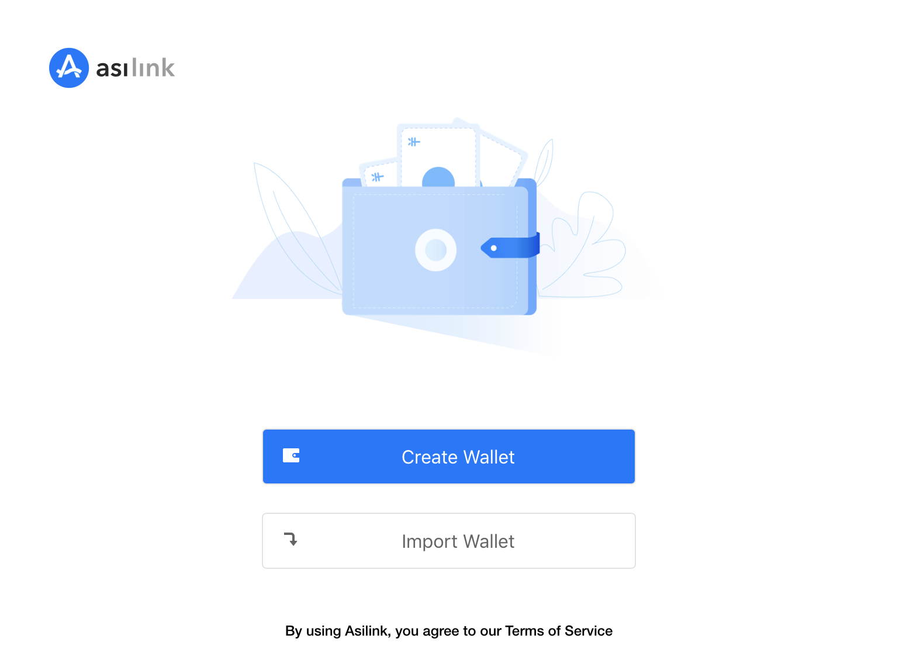
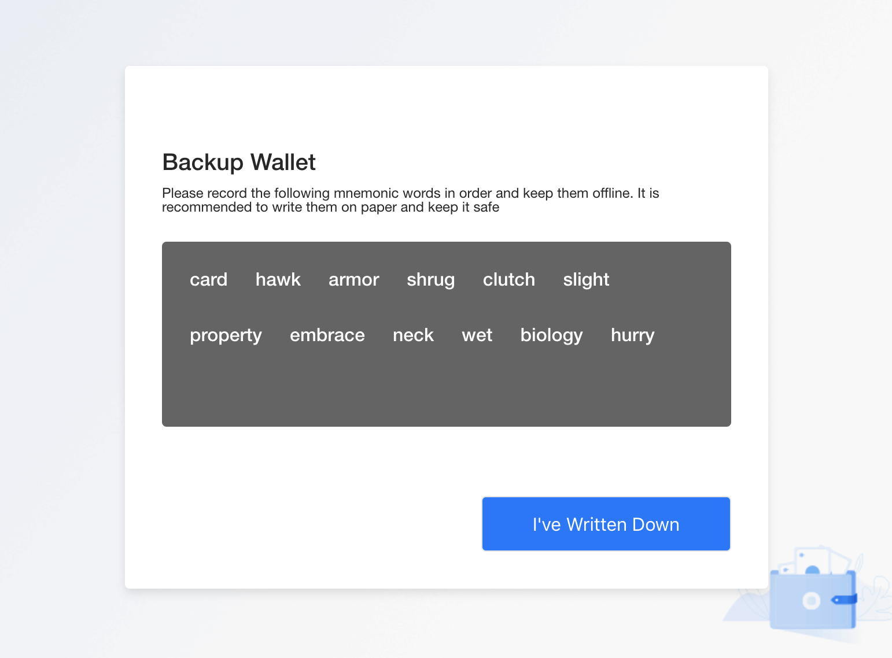
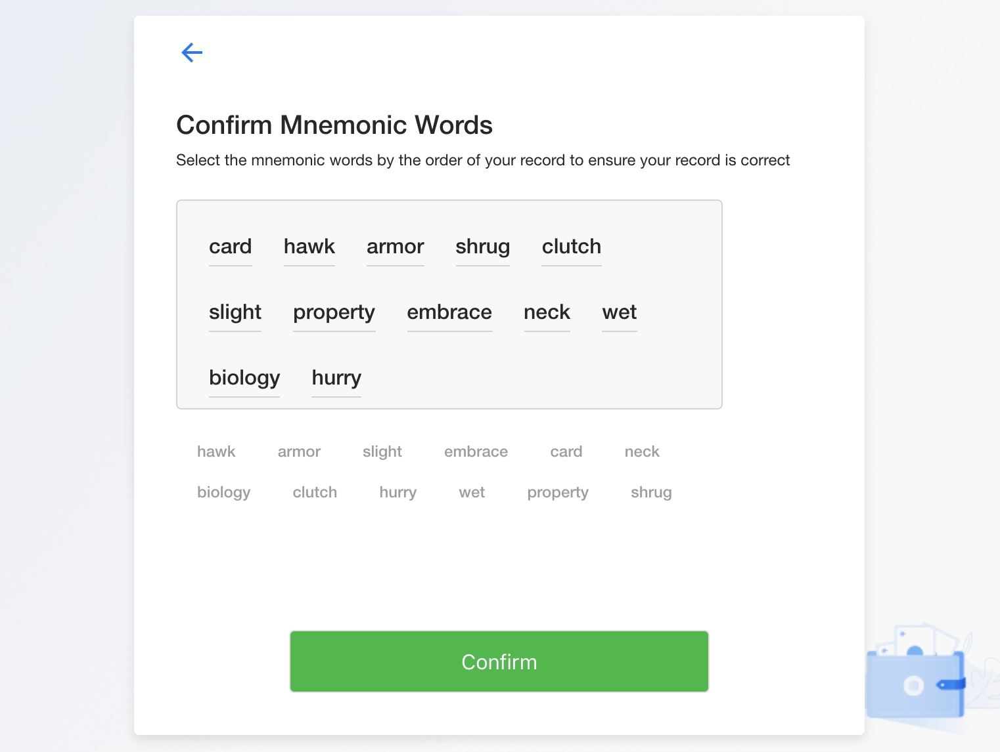
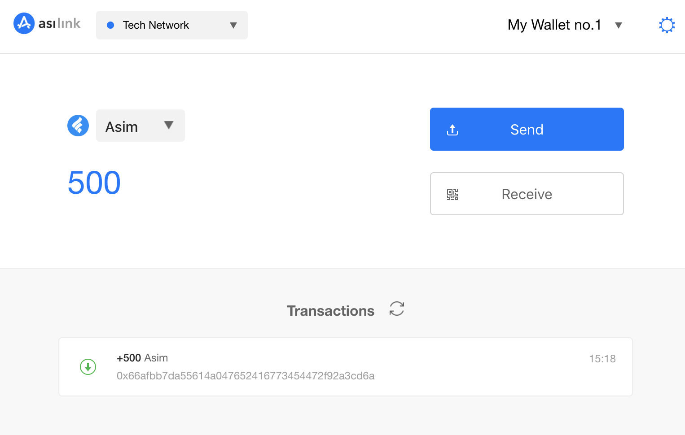
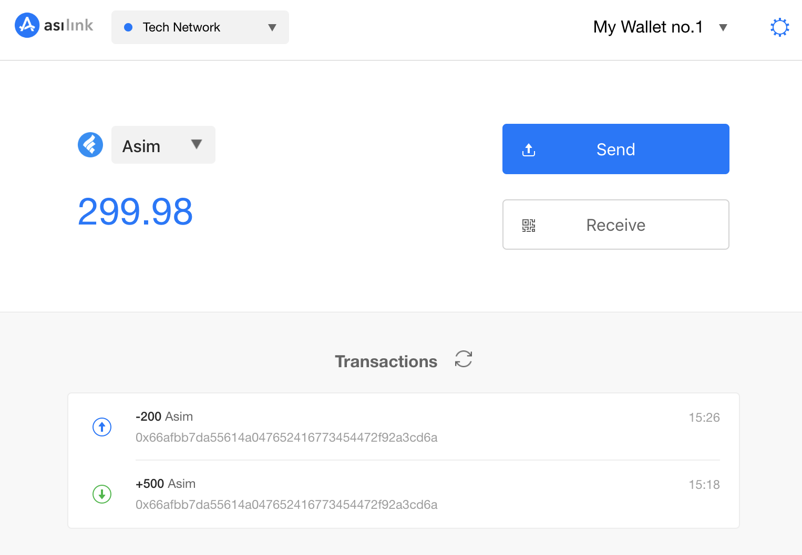

## Document Overview

This document briefly describes the use of the AsiLink wallet. AsiLink is the official Chrome-based plug-in wallet provided by Asimov.

## Download and Install

[Download](https://asimov.tech/wallet) AsiLink plugin wallet from the Asimov official website, open the Chrome browser extensions page (chrome://extensions/), unzip and drag in the **asilink.crx** file to install. Verify the wallet is installed successfully, as shown below:


## Setup Wallet

Open AsiLink and click the ```Create Wallet``` button.



Input user password.


Save the mnemonic words.



Verify the mnemonic words.



Click the ```Confirm``` button to create the wallet.

You can also import an existing wallet by providing mnemonic words saved before. Asilink supports multiple wallets and you can switch between them easily.

## Obtain Asim from Faucet

After the wallet is created successfully, switch to the Test Network. Initially there are no assets. Go to [IDE faucet](https://ide.asimov.tech/#/faucet) page to get some test Asim. Input the wallet address created above to receive some test Asim.


Open AsiLink to confirm the test Asim is received.



## Transfer

Click the ```Send``` button on AsiLink to open the transfer page. Input the target address and amount, click ```Confirm and Send```, then input the user password to submit the transaction.

> The default transaction fee in TestNet is 0.02 Asim. You can toggle "Advanced Options" to set a different value you perfer. The higher transaction fee you pay, the sooner the transaction will be confirmed on the chain.


Close AsiLink, wait for the block to to confirmed, and reopen it after 5 seconds to verify the transaction was successful.



You can also open the Ascan page and search for wallet address to confirm the transfer action.

