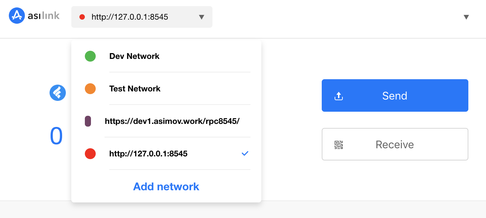

# Setup Asimov Fullnode

This document briefly introduces how to setup an asimov fullnode and run in either SOLO or TestNet mode.

Prerequisites:

- Basic blockchain knowledges

## Download Package

Download the latest binary file from Asimov [tutorial repository](https://github.com/seeplayerone/dapp-bin/tree/pai-governance/testnet-tutorial/bin).

You will find following files:

- full node binary file ```asimovd```
- wallet tool binary file ```wallet```
- sample configuration file ```asimovd.sample.conf```
- checksum `md5.md`

## Configurate Working Directory

Like Bitcoin and Ethereum, it is required to provide enough disk space to run the asimov full node. The default working directory is:

- ```~/.asimovd``` on POSIX OSes
- ```$LOCALAPPDATA/Asimovd``` on Windows
- ```~/Library/Application Support/Asimovd``` on Mac OS
- ```$home/asimovd``` on Plan9

You may create an ```asimovd.conf``` file (see below) from the ```asimovd.sample.conf``` file and put it under the default working directory.

## Configurate ```asimovd.conf```

```asimovd.conf``` contains all configuration parameters to run the asimov full node. Currently, we support 2 running modes:

### SOLO

In this mode, the node plays as the only block producer and rpc service provider in the network. 

```sh
; testnet,regtest,simnet
testnet=1
; solo,poa
consensustype=solo
miningaddr=<your_public_key_hash_address>
privatekey=<your_privatekey>
```

### TestNet

In this mode, the node will connect to Asimov testnet and sync up to the latest status of the testnet. The node only plays as the rpc service provider in testnet.

```sh
; testnet,regtest,simnet
testnet=1
; solo,pow,poa,mpos
consensustype=poa
privatekey=<your_privatekey>

addpeer=52.53.220.36
addpeer=18.162.40.196
```

### Private Key and Address

You need to configurate private key for both SOLO and TestNet mode, and mining address for SOLO mode. How to get them:

Run ```>./wallet -c genKey```

You will get an output like:

```sh
New key pair (priv, pubkey) (format:hex)
      { 0x1305e7ebe67d868c9112ef2fc707f497f579be4facef279eced7fb3dd0b3c807 ,  0x0230447ee4976fd98e0325fcebd44d25541eff40cee7084b7474d5eb449e0d7845 }
      Compressed pubkey hash address: 0x66affdf663256fe0f3852c814c5e6848a1f59bf3b8
```
Copy the private key and address to ```asimovd.conf``` respectively.

### RPC Port

The default rpc listening port is **8545**. If you want to change to another port, add the following line to ```asimovd.conf```:

```sh
rpclisten=:8888
```

## Run Asimov Fullnode

Once the working directory and ```asimovd.conf``` are set, you can run the asimov fullnode:

```./asimovd```

If you set the working directory to some location other then the default, you may run with the extra 	```homeDir``` parameter:

```./asimovd homeDir <Your Working Directory>```

## Clean Working Directory

If you want to clean the historical data and run the node from scratch again, do the following:

```sh
# stop asimovd
cd <Your Working Directory>
rm -rf data state logs
# restart asimov
```

## Test RPC

Once the node is up and running, the easist way to verify its RPC service is to test ```faucet``` function in IDE tool and transfer function in AsiLink wallet. 

Before test, you need to add a local network entry in AsiLink wallet, as shown below:



For more information about how to setup AsiLink wallet, please read [AsiLink](./asilink.md);

### FAUCET

Go to IDE tool [FAUCET](https://ide.asimov.tech/#/faucet) page, make sure to switch to local network on the up-right conner and reload the website if necessary. 

If you are running in SOLO mode, set your private key to make the corresponding mining address as the faucet address; otherwise, leave as default. Choose the asset type (**0000000000000000000000** which represents Asim), input the receving address (your wallet address), input the amount the click the ```Send``` button. Open the wallet to verify the test Asim is received successfully.


### ASILINK

Open Asilink wallet, click ```Send``` and transfer some amount of test Asim to other address. 


w