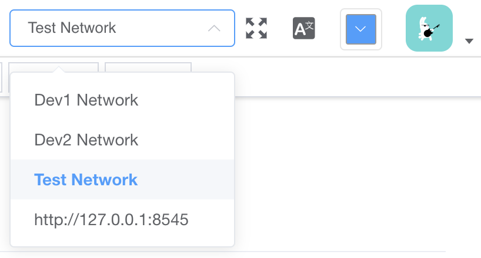

# IDE Tool

This document briefly introduces the features of Asimov [IDE Tool](https://ide.asimov.work). At this moment IDE tool is the most important tool provided by Asimov to develop/test smart contracts.

> In the future, we will provide alternatives such as full functional command line tools. And the IDE tool itself is also being updated rapidly.

## Switch Network

Similar to AsiLink wallet, you can switch network in the IDE tool from the up-right conner:

## Blocks and Transactions

You can view the latest block information on [BLOCKS](https://ide.asimov.work/#/blockchain) page, and search for specific transactions on [TRANSACTIONS](https://ide.asimov.work/#/transaction) page.

> Note that the block and transaction information provided by the IDE tool are raw data from PRC service. For better experiences, please view them on [AScan-TestNet](https://ascan.asimov.network/). 

## Create Template

As elabrated in [Tutorial of Contract Development](tutorial-contract.md), we adopt TEMPLATE design. Developers can go to [SUBMIT](https://ide.asimov.work/#/contract-template) page to upload contract source code and create tempates on chain.

## Review Template

> Note the [REVIEW](https://ide.asimov.work/#/contract-template-vote) feature is subjected to change in the future. And for now, review feature is disabled in TestNet. All templates submitted will be approved automatically.

Once a template is submitted, the security team will give a full review to make sure the contract logics are robust. They can either approve or decline a template after review.

## Deploy Template

All approved tempates will display on [DEPLOYMENT](https://ide.asimov.work/#/contract-deploy) page. For now, everyone can see others' templates as well. Find the template you need and provide the initialization parameters, you then can deploy a contract instance based on the template and have its address returned.

> You can have a better experience creating templates and deploying instances from the [Asimov Developers-TestNet](https://developer.asimov.network/) portal.

## Run/Test Contract

You can run contract functions and test contracts on [EXECUTION](https://ide.asimov.work/#/contract-call) page. The details of RUN and TEST are elabrated in [Tutorial of Contract Development](tutorial-contract.md) document.

## Settings

At the moment, you can set solidity compiler version on [SETTINGS](https://ide.asimov.work/#/setting) page. The latest version is **flow_4.0.0.js**.

## Faucet

You can fetch test Asim (the asimov system asset) from the [FAUCET](https://ide.asimov.work/#/receive) page. Details on how to do that are provided in [AsiLink](./asilink.md).

## Tools

At the moment, we provide easy access for developers to generate mnemonic and private key/address pairs based on BIP44 on [TOOLS](https://ide.asimov.work/#/tools) page.
