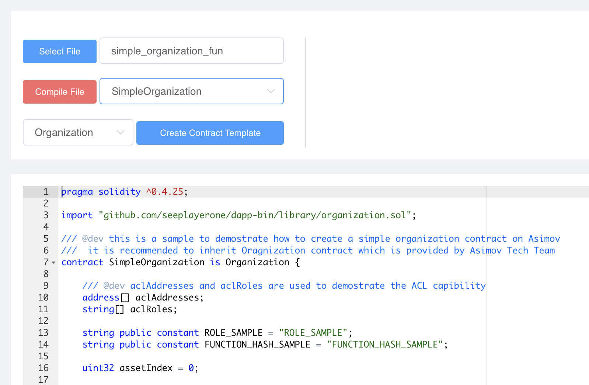
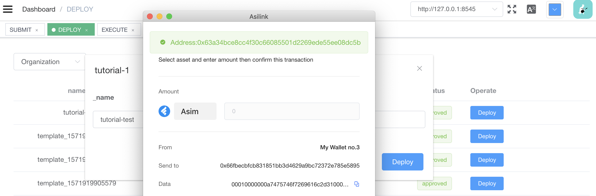
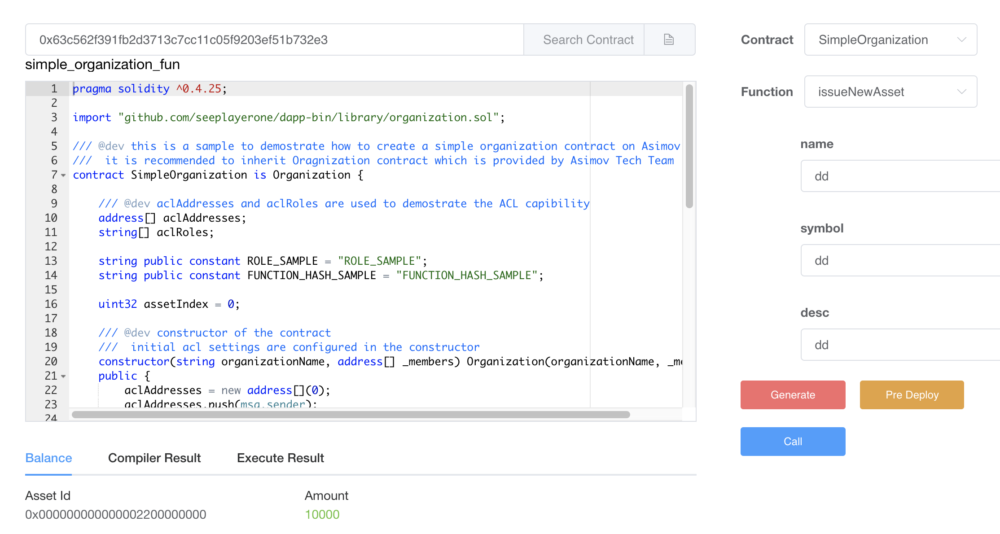

## Document Overview

This document provides a brief description of how to develop, deploy, and invoke smart contracts on the Asimov platform.

## Unsupported Solidity Methods

The Asimov virtual machine is compatible with EVM. We recommend using [Solidity](https://solidity.readthedocs.io/en/v0.4.25/) as the development language for smart contracts. Asimov has made some improvements based on EVM and will not support the following Solidity methods:

- ```staticCall``` ```callCode``` ```delegateCall``` These three methods allow the called contract to change the storage space of the calling contract, which is a security risk, and Asimov will no longer support them.

- ```create``` ```new``` Both methods deploy new contracts inside the contract by calling ```opCreate``` instruction. Asimov introduced the design of [TEMPLATE](https://doc.asimov.network/wp/template-design.html), providing a new ```deployContract``` method to support the deployment of new contracts within the contract.

- ```send``` ```transfer``` ```value``` Asimov introduces the design of [MUTXO](https://doc.asimov.network/wp/mutxo-design.html), and asset transfer requires asset type and properties. A new ```transfer``` method is provided to support that.

> Asimov adpots Solidity version 0.4.25, and Solidity features in newer version will not be supported at this stage.


## New features of Asimov

Compared to EVM, the Asimov virtual machine has been modified to support following designs:

- [TEMPLATE](https://doc.asimov.network/wp/template-design.html)
- [MUTXO](https://doc.asimov.network/wp/mutxo-design.html)

On the Asimov platform, users need to upload the developed smart contract to the Asimov template warehouse from the Developer Center, which then becomes a template. The corresponding contract instance is then deployed based on the template.

Two important things to note related to template when developing smart contracts:

- All template contracts need to inherit the [template.sol](https://github.com/seeplayerone/dapp-bin/blob/master/library/template.sol) base contract directly or indirectly.
- When deploying new contract inside a contract, use the ```flow.deployContract()``` method.

Based on the MUTXO design, all assets on the Asimov platform are native UTXO assets, and Asimov provides the following two instructions for creating new UTXO assets and for issuing additional UTXO assets.

- Create an asset ```flow.createAsset()```
- Issue additional asset ```flow.mintAsset()```

At the same time, Asimov provides a new ```to.transfer()``` method to support transfer of different types of native UTXO asset, and a ```msg.asset()``` method for the contract to get the type and properties of the asset from the transaction.


## New Methods in Detail

```flow.deployContract(uint16 category, string name, bytes params)```

Deploy a new contract inside a contract. 

- **category** Template cateory.
- **name** Template name. The template category and template name are set when the template is created in the Developer Center.
- **params** Contract initialization parameters.

-------

```flow.createAsset(uint32 assetType, uint32 assetIndex, uint amount)```

Create a new UTXO asset inside the contract.

> The prerequisite for creating and issuing additional UTXO assets is that the contract is registered on the Asimov platform and the organization id is obtained.

- **assetType** corresponds to the AssetType field in the MUTXO design, 32bit.
- **assetIndex** corresponds to the AssetIndex field in the MUTXO design, 32bit.
- **amount** The number of assets created. If it is an indivisible asset, it is the ID of the asset.

-------

```flow.mintAsset(uint32 assetIndex, uint amount)```

Issue additional UTXO asset inside the contract.

- **assetIndex** corresponds to the AssetIndex field in the MUTXO design, 32bit.
- **amount** The number of assets issued. If it is an indivisible asset, it is the ID of the asset.

-------

```to.transfer(uint amount, uint96 asset)```

Transfer asset to a specific address.

- **to** destination address.
- **amount** The number of assets transferred. If it is an indivisible asset, it is the ID of the asset.
- **asset** corresponds to the (AssetType + OrganizationID + AssetIndex) fields in the MUTXO design, each 32bit, a total of 96bit.

-------

```msg.asset()```

Get the asset type and properties of the transaction inside a contract. Returns **asset** as defined in ```transfer()``` method above.

> Regarding the definition of the above **asset** parameter, as shown in the following figure: the organization with an Organization ID of 25 (hexadecimal, 00000025 in the middle part) issued two assets, with the AssetIndex 0 and 1 respectively (00000000 and 00000001 in the right part). AssetType are both defaults to 00000000 (00000000 in the left part).


## Basic Contracts

In theory, developers familiar with the Solidity language can combine the above-mentioned new features of Asimov to complete the development of various smart contracts from scratch. But in order to alleviate the developer's workload and make better use of the capabilities provided by Asimov, we offer the following basic contracts.

- [acl.sol](https://github.com/seeplayerone/dapp-bin/blob/master/library/acl.sol)
- [asset.sol](https://github.com/seeplayerone/dapp-bin/blob/master/library/asset.sol)
- [organization.sol](https://github.com/seeplayerone/dapp-bin/blob/master/library/organization.sol)

The [acl](https://github.com/seeplayerone/dapp-bin/blob/master/library/acl.sol) contract provides a permission control framework at the contract method level:

1. Restrict specific addresses to access a method through ```authAddresses()``` modifier.
2. Define roles, and restrict specific roles to access a method through ```authRoles()``` modifier.
3. Define function hash, and restrict addresses or roles linked with this function hash to access a method through ```authFunctionHash()``` modifier.

Through a set of configuration methods to manage the links between (role - address), (function hash - address) and (function hash - role), Asimov enables dynamic access control configuration after a contract is deployed.

The [asset](https://github.com/seeplayerone/dapp-bin/blob/master/library/asset.sol) contract stores detailed information about all assets issued by the organization, including:

1. Basic information of the asset, name, code, description, total amount, etc.;
2. The basic properties of the asset, whether it can be divided, whether it is restricted in circulation, whether it is anonymous or not (corresponds to the AssetType field in the MUTXO design);
3. Address whitelist of an asset;
4. The initial and additional issuance history of assets.

The [organization](https://github.com/seeplayerone/dapp-bin/blob/master/library/organization.sol) contract inherits the template, acl, and asset contracts. And provides a simple organization structure: several members with the same rights, and new members are added by invitation. We recommend that third-party organization contracts inherit [organization.sol](https://github.com/seeplayerone/dapp-bin/blob/master/library/organization.sol) for development to streamline processes and improve standards.

## Samples

Asimov's official website provides a simple autonomous organization implementation, the corresponding organization contract is [dao_asimov.sol](https://github.com/seeplayerone/dapp-bin/blob/master/library/dao_asimov.sol). The contract inherits organization.sol and adds a "president" role to its organizational structure to manage the organization.

Another example of an organization contract [simple_organization.sol](https://github.com/seeplayerone/dapp-bin/blob/master/library/simple_organization.sol) is much simpler.

## Create Contract Template

After the contract is developed, developers can create contract template, deploy contract instance, and call contract methods through the [Asimov Developer Center](https://ide.asimov.work).

The specific steps to create a template are as follows:

- Upload the developed contract.
- Input template name and choose template category (As shown in the figure below, the name is ```simple_organization_fun``` and the type is ```Organization```).
- Compile the contract.
- Choose the contract class used to create the template (As shown below, ```SimpleOrganization```).
- Click the ```Create Contract Template``` button to invoke the AsiLink wallet plugin to submit the transaction.



## Deploy Contract Instance

The specific steps to deploy a contract instance are as follows:

- On the Developer Center's [DEPLOYMENT](https://ide.asimov.work/#/contract-deploy) page, find the contract template you just created.
- Click the ```Deploy``` button and fill in the initialization parameters (As shown in the figure below, the organization name is "jack", and the initial member list is empty).
- Click the ```Deploy``` button to invoke the AsiLink wallet plugin to submit the transaction.

After the contract instance is deployed successfully, the AsiLink wallet will return the address of the instance and please save the address for the next steps.



## Call Contract Methods

The specific steps to call contract methods are as follows:

- On the Developer Center's [EXECUTION](https://ide.asimov.work/#/contract-call) page, input the contract address saved in the previous step to search.
- After loading the contract template, select the contract class and select the method you want to execute on the right.
- Click the ```Call``` button to invoke the AsiLink wallet plugin to submit the transaction.
- Verify the result. In the example below, we call the ```registerMe``` method to register the organization, then call ```issueNewAsset``` to issue a new asset, and you can see from the left bottom conner that the asset has been created successfully.

