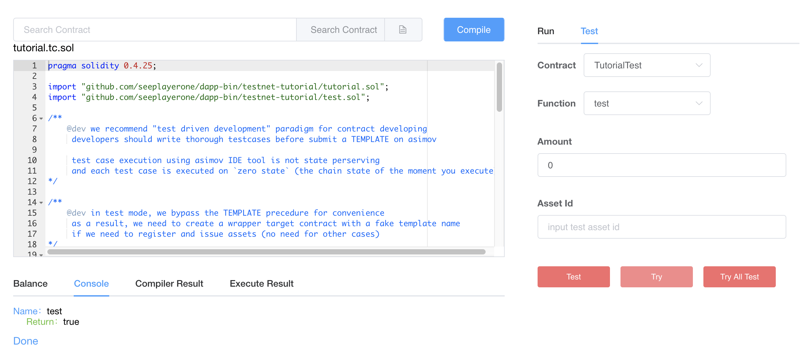

# Document Overview

This document provides a brief description of how to develop, test, and deploy smart contracts on the Asimov platform.

Prerequistes:

- Blockchain and smart contract
- Ethereum VM and Solidity 

## Develop Contract

The Asimov virtual machine is compatible with EVM. We recommend using [Solidity](https://solidity.readthedocs.io/en/v0.4.25/) as the development language for smart contracts. Developing contracts on Asimov are almost the same as on Ethereum. 

Asimov has made some improvements based on EVM and developers need to be aware of following things:

- ```staticCall``` ```callCode``` ```delegateCall``` These three methods allow the called contract to change the storage space of the calling contract, which is a security risk, and Asimov will no longer support them.

- ```create``` ```new``` Both methods deploy new contracts inside the contract by calling ```opCreate``` instruction. Asimov introduces the design of TEMPLATE, and provides a new ```deployContract``` method to support the deployment of new contracts within the contract. ```create``` and ```new``` are only available in test mode.

- ```send``` ```transfer``` ```value``` Asimov introduces the design of MUTXO, and asset transfer requires an additional **assettype**. New ```transfer``` method and ```call``` method are provided to support that.

> Asimov adpots Solidity version 0.4.25, and Solidity features in newer version will not be supported at this stage.


### TEMPLATE

On the Asimov platform, users need to upload the developed smart contract to the Asimov template warehouse from the [IDE tool](https://ide.asimov.work/#/) or [Developer Center](https://developer.asimov.network/), which then becomes a template. The corresponding contract instance is then deployed based on the template.

Two important things to note related to template when developing smart contracts:

- All template contracts need to inherit the [Template](https://github.com/seeplayerone/dapp-bin/blob/master/library/template.sol) base contract directly or indirectly.
- When deploying new contract inside a contract, use the ```flow.deployContract()``` method.

-------

```flow.deployContract(uint16 category, string name, bytes params)```

Deploy a new contract inside a contract. 

- **category** template cateory.
- **name** template name. The template category and template name are set when the template is created.
- **params** contract initialization parameters.


### MUTXO

All assets on the Asimov platform are native UTXO assets. We designed **assettype** to distinguish different types of UTXO.

Note a contract needs to register to Asimov platform and get an organization ID before issuing assets. This is demostrated in the [Tutorial](https://github.com/seeplayerone/dapp-bin/blob/master/testnet-tutorial/tutorial.sol).

> Regarding the definition of the above **assettype** parameter, as shown in the following figure: the organization with an Organization ID of 25 (hexadecimal, 00000025 in the middle part) issued two assets, with the index 0 and 1 respectively (00000000 and 00000001 in the right part). Properties are both defaults to 00000000 which is a normal fungible asset (00000000 in the left part).


-------

```flow.createAsset(uint32 properties, uint32 index, uint amount)```

Create a new UTXO asset inside the contract.

- **properties** 32bit long asset properties.
- **index** 32bit long asset index inside an orgnization.
- **amount** the number of assets to create.

-------

```flow.mintAsset(uint32 index, uint amount)```

Issue additional UTXO asset inside the contract.

- **index** 32bit long asset index inside an orgnization.
- **amount** the number of assets to mint.

-------

```flow.balance(address dest, uint96 assettype)```

Get balance of a specific asset on a given address.

- **dest** the address to fetch balance of.
- **assettype** the assettype to fetch balance of.

-------

```to.transfer(uint amount, uint96 assettype)```
```to.call.value(uint amount, uint96 assettype)```

Transfer asset to a specific address.

- **to** destination address.
- **amount** the number of assets to transfer. 
- **assettype** the assettype to transfer.

-------

```msg.asset()```

Get the assettype of the transaction inside a contract. Returns **assettype** as defined above.

### Tutorial Project

We have created a [tutorial project](https://github.com/seeplayerone/dapp-bin/tree/master/testnet-tutorial) to demostrate how to develop a simple contract to experience the exclusive features of Asimov described above.

## Test Contract

We recommend to adopt a **Test Driven Development** paradigm for contract development.

Once finish designing and implementing a smart contract, it is a good practice to write thorough unit tests to fully cover every single function uint of a contract. There are usually two ways to write test cases for a contract, either using other smart contracts or through js library. We are prefering the former one for now as it has better support from the IDE tool.

We have provided a [test contract](https://github.com/seeplayerone/dapp-bin/blob/master/testnet-tutorial/tutorial.tc.sol) in the tutorial project. 

We can run a test contract in "test mode" in IDE tool: we don't need to create a template for the test contract or the target contract it is testing against, and the execution is not state perserving. In order to support that, ```new``` and ```create``` are enabled in "test mode".

### Test in IDE

Go to the IDE [EXECUTION](https://ide.asimov.work/#/contract-call) page: 

- click the file icon to upload the test contract.
- click ```Compile``` to compile the test contract.
- click the ```Test``` tab on the right pane. click the ```Console```tab on the bottom pane.
- select the contract instance to test agianst, as shown in the figure below we choose ```TutorialTest```. 
- select the specific test function to execute, as shown in the figure below we choose ```test```.
- click ```Try``` button and you can see the test result in the console.
- click ```Try All Test``` button will execute all functions with **test** prefix in the selected contract instance.



## Deploy Contract

After thorough tests, you may deploy your contract through the IDE tool.

As we adpots the TEMPLATE design, there are three sub steps to deploy/run a contract on Asimov.

### Create Contract Template

Go to the IDE [SUBMIT](https://ide.asimov.work/#/contract-template) page:

- click ```Select File``` to upload the developed contract.
- input template name and choose template category (As shown in the figure below, the name is ```tutorial-1``` and the category is ```Organization```).
- click ```Compile File``` to compile the contract.
- choose the contract instance used to create the template (As shown below, ```Tutorial```).
- click the ```Create Contract Template``` button to invoke the AsiLink wallet plugin to submit the transaction.


### Deploy Contract Instance

Go to the IDE [DEPLOYMENT](https://ide.asimov.work/#/contract-deploy) page:

- find the contract template you just created.
- click the ```Deploy``` button and fill in the initialization parameters (none in our sample).
- click the ```Deploy``` button to invoke the AsiLink wallet plugin to submit the transaction.

After the contract instance is deployed successfully, the AsiLink wallet will return the address of the instance and please save the address for the next steps.


### Call Contract Functions


Go to the IDE [EXECUTION](https://ide.asimov.work/#/contract-call) page:

- input the contract address saved in the previous step and click ```Search Contract```.
- after loading the contract template, select the contract instance and select the function you want to execute on the right pane (As shown in the figure below, the contract instance is ```Tutorial``` and the function is ```mint```).
- click the ```Call``` button to invoke the AsiLink wallet plugin to submit the transaction.
- click the ```Balance``` tab on the buttom pane to verify the asset has been mint.


## APPENDIX: Basic Contracts

In theory, developers familiar with the Solidity language can combine the above-mentioned new features of Asimov to complete the development of various smart contracts from scratch. But in order to alleviate the developer's workload and make better use of the capabilities provided by Asimov, we offer the following basic contracts.

- [acl.sol](https://github.com/seeplayerone/dapp-bin/blob/master/library/acl.sol)
- [asset.sol](https://github.com/seeplayerone/dapp-bin/blob/master/library/asset.sol)
- [organization.sol](https://github.com/seeplayerone/dapp-bin/blob/master/library/organization.sol)

The [acl](https://github.com/seeplayerone/dapp-bin/blob/master/library/acl.sol) contract provides a permission control framework at the contract method level:

1. Restrict specific addresses to access a method through ```authAddresses()``` modifier.
2. Define roles, and restrict specific roles to access a method through ```authRoles()``` modifier.
3. Define function hash, and restrict addresses or roles linked with this function hash to access a method through ```authFunctionHash()``` modifier.

Through a set of configuration methods to manage the links between (role - address), (function hash - address) and (function hash - role), Asimov enables dynamic access control configuration after a contract is deployed.

The [asset](https://github.com/seeplayerone/dapp-bin/blob/master/library/asset.sol) contract stores detailed information about all assets issued by the organization, including:

1. Basic information of the asset, name, code, description, total amount, etc.;
2. The basic properties of the asset, whether it can be divided, whether it is restricted in circulation, whether it is anonymous or not (corresponds to the **assettype** set when creating the asset);
3. Address whitelist of an asset;
4. The initial and additional issuance history of assets.

The [organization](https://github.com/seeplayerone/dapp-bin/blob/master/library/organization.sol) contract inherits the template, acl, and asset contracts. And provides a simple organization structure: several members with the same rights, and new members are added by invitation. We recommend that third-party organization contracts inherit [organization.sol](https://github.com/seeplayerone/dapp-bin/blob/master/library/organization.sol) for development.


### Samples

Asimov's official website provides a simple autonomous organization implementation, the corresponding organization contract is [dao_asimov.sol](https://github.com/seeplayerone/dapp-bin/blob/master/library/dao_asimov.sol). The contract inherits organization.sol and adds a "president" role to its organizational structure to manage the organization.

Another example of an organization contract [simple_organization.sol](https://github.com/seeplayerone/dapp-bin/blob/master/library/simple_organization.sol) is much simpler.